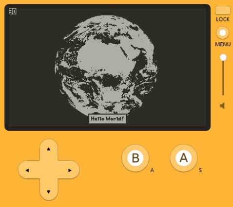

# Hello World in C

An extended "Hello World" project for the Playdate game system that exclusively uses the Playdate SDK's C API to demo basic handling of hardware inputs and loading assets like images, sounds, and fonts.

It also explores setting game metadata and the build and install process in general to produce distributable production builds for Playdate game systems.

This is what it looks like running in the Playdate Simulator when operating the crank:




# Project Structure

- `/guide_html/` - contains a guide discussing this project and Playdate C development in more detail.
- `/src/` - contains the project's C source files.
- `/src/assets/` - contains the project's game assets like images.
- `/src/pdxinfo` - the project's Playdate game metadata file.
- `/include/` - contains the project's C header files. (Configured to be so in `/CMakeLists.txt`).
- `/scripts/` - contains convenient script files to compile things and produce distributables. Generally, these should be executed from project root and will perform out-of-source CMake builds.
- `/CMakeLists.txt` - CMake build script that does the heavy lifting during build. Edit when adding new C source/header files.
- `/copy-assets-playdate.cmake` - this project's CMake build script that copies game metadata and any game assets from `/src/` to build directories.


# Building

This project relies on Playdate SDK's CMake build scripts but also provides script files in `scripts/` to simplify producing distributable game builds.

A Playdate game build is the generated directory having a name like `/<PLAYDATE_GAME_NAME>.pdx`. This project's build scripts will generate a zip archive of it into "dist/" ready for distribution.

Here's what you need to do before building Playdate games/projects on Windows:

- Download the Playdate SDK from Panic (this project worked with 2.5.0).
- Download CMake (version >= `cmake_minimum_required` declared in `/CMakeLists.txt`. worked with 3.26.3).
- Download MinGW (Windows: MinGW-w64, "seh-ucrt". worked with 13.2.0).
- Download Arm GNU Toolchain (target: "arm-none-eabi", Windows: "mingw-w64-i686". worked with 13.2.Rel1).
- Set the following ENV for the Playdate SDK:
  - `PATH` - absolute path to CMake bin/ directory
  - `PATH` - absolute path to MinGW bin/ directory
  - `PATH` - absolute path to Arm GNU Toolchain bin/ directory
  - `PLAYDATE_SDK_PATH` - absolute path to Playdate SDK root directory
- Set the following ENV for this project's build scripts (or edit where the build script you're executing accesses them):
  - `PD_MAKE_PATH` - absolute path to MinGW's `make.exe` (`mingw32-make.exe`)
  - `PD_CMAKE_C_COMPILER` - absolute path to MinGW's `gcc.exe`
  - `PD_CMAKE_TOOLCHAIN_FILE` - absolute path to Playdate SDK's `arm.cmake` CMake script
- (Note for ENV paths: use forward slash ( / ) as path separators; keep total path name lengths short)

Execute the build scripts with the root of this project as `CWD`. These handle copying any game metadata and assets and executing CMake/Make. Note: They will delete and regenerate the build directories. For example, to execute the MinGW batch file in PowerShell:

```batch
./scripts/build_mingw_win.cmd
```

After a successful build, you have a few options to install and test/play it:

- Open the generated Playdate distributable directory with the Playdate Simulator.
- Upload it to a USB-connected Playdate system with the Playdate Simulator after opening the distributable directory.
- Sideload it onto a Playdate system manually by inserting the distributable directory into the system's "Games" directory.
- Sideload it through Playdate's online "Sideload a Game" web interface by uploading the zip archive of the distributable directory.


# License

MIT license. See `/LICENSE`.


gl hf ka

